# Repetition of the Bachelor's Thesis Experiment
$\rightarrow$ running analysis tests on code correctness and quality based on generated data for 6 different algorithms in java  
$\rightarrow$ including the adjustment of the prompt of the breadth first search algorithm. It was changed from *"Implement a non-static breadth search first class"* to *"Implement a non-static breadth first search class"* (due to a spelling mistake)

## Code Correctness
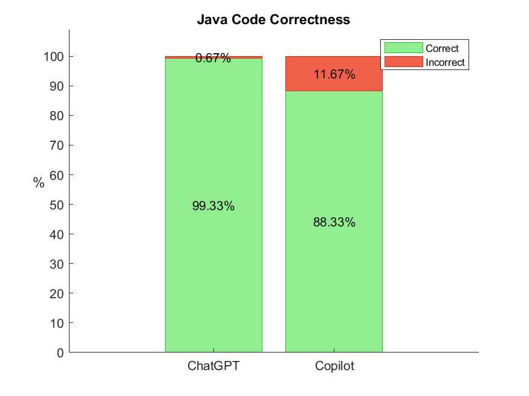  

The code correctness of ChatGPT shown in the figure above, was 12% higher than in the bachelor's thesis, reaching nearly perfect correctness of 99.33%. 
On the other side, the code correctness of Copilot was only 0.67% lower than in the thesis, with 88.33%.  

| |ChatGPT data | Copilot data |
|---------|----------|---------|
|Mean, Mode, Median |https://www.ai-therapy.com/psychology-statistics/results/20230916114202387 | https://www.ai-therapy.com/psychology-statistics/results/20230916114318808 |
|Dispersion | https://www.ai-therapy.com/psychology-statistics/results/20230916114425915 | https://www.ai-therapy.com/psychology-statistics/results/20230916114341808 |
|Normality test | https://www.ai-therapy.com/psychology-statistics/results/20230916114518502 | https://www.ai-therapy.com/psychology-statistics/results/20230916114551520 |

### Hypothesis testing data table for the code correctness
Testing the code correctness of ChatGPT against Copilot:

|[Mann-Whitney U-Test](https://www.ai-therapy.com/psychology-statistics/results/20230916090806752) | code correctness|
|---|---|
|U| 40050.000|
|z-score|- 5.460|
|p | < 0.001|
|Effect size r| - 0.223|  

$\rightarrow$ statistically significant difference based on a significance level of 0.01

### Frequency table for the code correctness results for ChatGPT and Copilot
| | number of generations | correct generations | incorrect generations|
|---------|-----------------------|---------------------|----|
|ChatGPT| 300| 298                 |2|
|Copilot| 300| 265                 |35|

## Code Quality
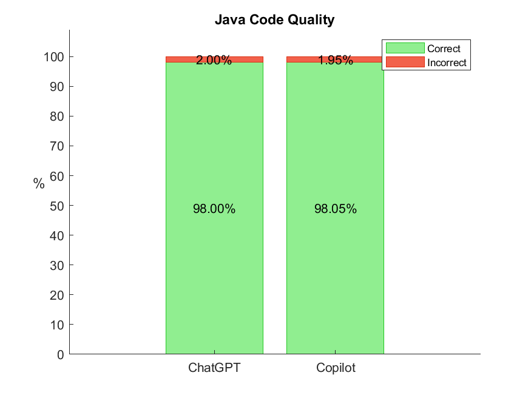  

The experiment showed a code quality of 98.00% for ChatGPT and 98.05% for Copilot. This shows that both ChatGPT and Copilot are able to generate code of very high quality. The quality measurements were the same as described in the bachelor thesis.  
For comparison, the code quality in the thesis reached 98.52% for ChatGPT and 94.07% for Copilot. 

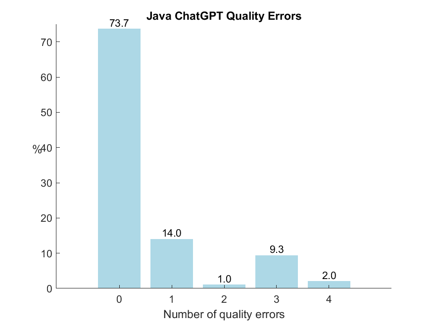  

The percentage of zero quality errors for ChatGPT was 7% lower compared to the bachelor's thesis. 
Apart from that, the results were generally similar.

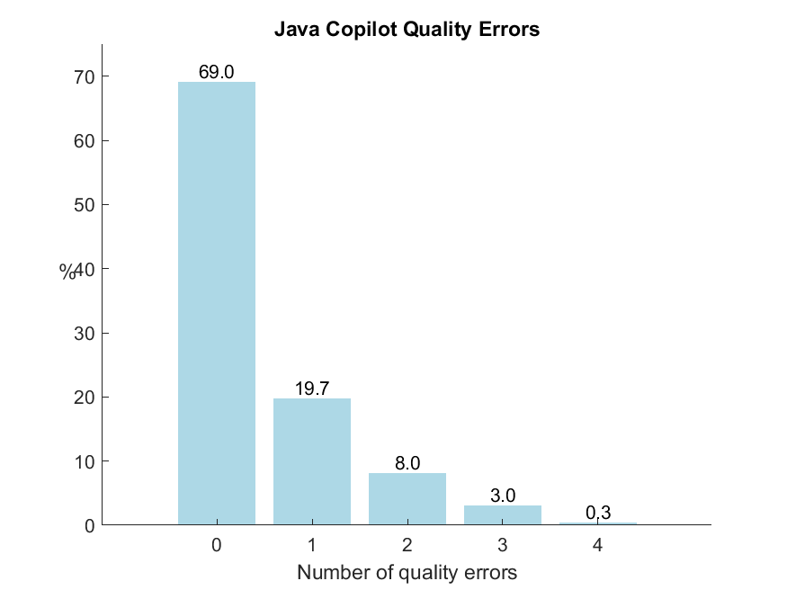  

The percentage of zero quality errors for Copilot was 4.3% higher than in the bachelor's thesis. 
In this experiment a maximum of only four quality errors occurred, while the thesis reached a maximum of 20 quality errors.

| |ChatGPT data | Copilot data |
|---------|----------|---------|
|Mean, Mode, Median | https://www.ai-therapy.com/psychology-statistics/results/20230922121251868 | https://www.ai-therapy.com/psychology-statistics/results/20230922121724633 |
|Dispersion | https://www.ai-therapy.com/psychology-statistics/results/20230922121356303 | https://www.ai-therapy.com/psychology-statistics/results/20230922121638160 |
|Normality test | https://www.ai-therapy.com/psychology-statistics/results/20230922121505426  | https://www.ai-therapy.com/psychology-statistics/results/20230922121602550 |

### Hypothesis testing data table for the code quality
Testing the code quality of ChatGPT against Copilot:

|[Mann-Whitney U-Test](https://www.ai-therapy.com/psychology-statistics/results/20230922121046661) | Code Quality |
|---|---|
|U| 43683.500 |
|z-score| -0.780 |
|P| 0.435 |
|Effect size r| -0.032 |  

$\rightarrow$ no statistically significant difference based on a significance level of 0.05

### Representation of code quality results
| |  Total number of lines|  Lines without errors| Lines with errors|
|---|---|---|---|
|ChatGPT| 7793| 7637|156|
|Copilot| 7070| 6932|138|

### Frequency tables
**ChatGPT:**  

| No. of quality rule violations |0|1|2|3|4|
|---|---|---|---|---|---|
|Frequency|221|42|3|28|6|  
  
**Copilot:**
| No. of quality rule violations |0|1|2|3|4|
|---|---|---|---|---|---|
|Frequency|207|59|24|9|1|

### Descriptive statistics of the code quality results

**ChatGPT:**  

|Number of samples |	300 |
|---|---|
|Mean| 0.520 |
|Standard error of the mean|0.060| 
|95% confidence interval for the mean| [0.402, 0.638] |
|Median| 0.00|
|Mode| 	0 (Count = 221)|
|Range| 	4 - 0 = 4| 
|Interquartile range (IQR)| 	1.000 - 0.000 = 1.000|
|Sample standard deviation|  	1.036|  
  
**Copilot:**
|Number of samples |	300 |
|---|---|
|Mean| 0.460 |
|Standard error of the mean| 0.046 |
|95% confidence interval for the mean| [0.370, 0.550] |
|Median| 0.00|
|Mode| 	0 (Count = 207)|
|Range| 	4 - 0 = 4|
|Interquartile range (IQR)| 	1.000 - 0.000 = 1.000|
|Sample standard deviation|  	0.794|

## Comparison to the bachelor's thesis
The code correctness was 11.34% higher for ChatGPT and 13% lower for Copilot.  
The code quality was 0.52% lower for ChatGPT and 3.98% higher for Copilot.

___

# II. Evaluation of differences between results of the project group and the bachelor's thesis

## Mann-Whitney U test
- Is there a difference in the rank sums of the two groups?
- different subjects $\rightarrow$ independent samples
- non-parametric test
- ordinal data
- unpaired samples for two groups: ChatGPT and Copilot
    - samples are generated randomly from different populations and indepented from each other
- Hypothesis:
    - H0: The difference between the current results and the bachelor's thesis is not significant.
    - H1: The difference between the current results and the bachelor's thesis is significant.

## Results
The code correctness and quality were tested with the Mann-Whitney U test, because one of the instruction prompts was changed according to a spelling mistake. Therefore, it is assumed that the samples are independent. 

### Code Correctness

**Code Correctness ChatGPT:**  
Testing the code correctness of ChatGPT achieved in the bachelor's thesis against our results:

| [Mann-Whitney U Test](https://www.ai-therapy.com/psychology-statistics/results/20230916113200481) | Code Correctness ChatGPT |
| --- | --- |
| U | 39600.000 |
| z-score | -5.887 |
| p-value | < 0.001 |
| effect size r | -0.240 |  

$\rightarrow$ statistically significant difference based on a significance level of 0.01

**Code Correctness Copilot:**  
Testing the code correctness of Copilot achieved in the bachelor's thesis against our results

| [Mann-Whitney U Test](https://www.ai-therapy.com/psychology-statistics/results/20231111215121702) | Code Correctness Copilot |
| --- | --- |
| U | 44700.000 |
| z-score | -0.257 |
| p-value | 0.797 |
| effect size r | -0.011 |  

$\rightarrow$ no statistically significant difference based on a significance level of 0.05

### Code Quality

**Code Quality ChatGPT:**  
Testing the code quality of ChatGPT achieved in the bachelor's thesis against our results:  

| [Mann-Whitney U Test](https://www.ai-therapy.com/psychology-statistics/results/20230922122227067) | Code Quality ChatGPT |
| --- | --- |
| U |  41966.000 |
| z-score | -1.947 |
| p-value | 0.052 |
| effect size r |  -0.079 |  

$\rightarrow$ no statistically significant difference based on a significance level of 0.05

**Code Quality Copilot:**  
Testing the code quality of Copilot achieved in the bachelor's thesis against our results:

| [Mann-Whitney U Test](https://www.ai-therapy.com/psychology-statistics/results/20230922122522604) | Code Quality Copilot  |
| --- | --- |
| U |  41025.000 |
| z-score | -2.243 |
| p-value |  0.025 |
| effect size r | -0.092 |  

$\rightarrow$ statistically significant difference based on a significance level of 0.05

___

# III. Re-Running the experiment with Python Code
$\rightarrow$ running analysis tests on code correctness and quality based on generated data for 6 different algorithms in Python  

## Code Correctness
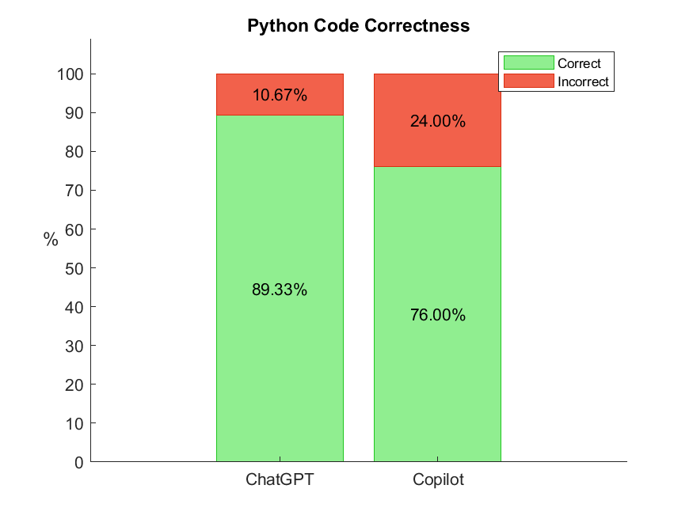   

The experiment showed a code correctness of 89.33% with ChatGPT and 76% with Copilot.
This is about 10% less than the achieved results in Java for ChatGPT and 12% less for Copilot.  
  
**Hypothesis test - comparing ChatGPT and Copilot:**  
Comparing the code correctness of ChatGPT with Copilot:
|[Mann-Whitney U-Test](https://www.ai-therapy.com/psychology-statistics/results/20230916110210216) | Code Correctness |
|---|---|
|U| 39000.000 |
|z-score| - 4.310 |
|P|  < 0.001 |
|Effect size r|  - 0.176 |  

$\rightarrow$ statistically significant difference between Copilot and ChatGPT based on a significance level of 0.01 

**Hypothesis test - comparing Java and Python:**  
Comparing the code correctness of ChatGPT for algorithms written in Java with the results for Python:
|[Mann-Whitney U-Test](https://www.ai-therapy.com/psychology-statistics/results/20230916115401878) | ChatGPT |
|---|---|
|U| 40500.000|
|z-score| -5.293|
|P| < 0.001 |
|Effect size r| -0.216 |  

$\rightarrow$ statistically significant difference between Python and Java based on a significance level of 0.01

Comparing the code correctness of Copilot for algorithms written in Java with the results for Python:
|[Mann-Whitney U-Test](https://www.ai-therapy.com/psychology-statistics/results/20230916115743306) | Copilot |
|---|---|
|U| 39450.000|
|z-score| -3.943 |
|P| < 0.001|
|Effect size r| -0.161|  

$\rightarrow$ statistically significant difference between Python and Java based on a significance level of 0.01

## Code Quality
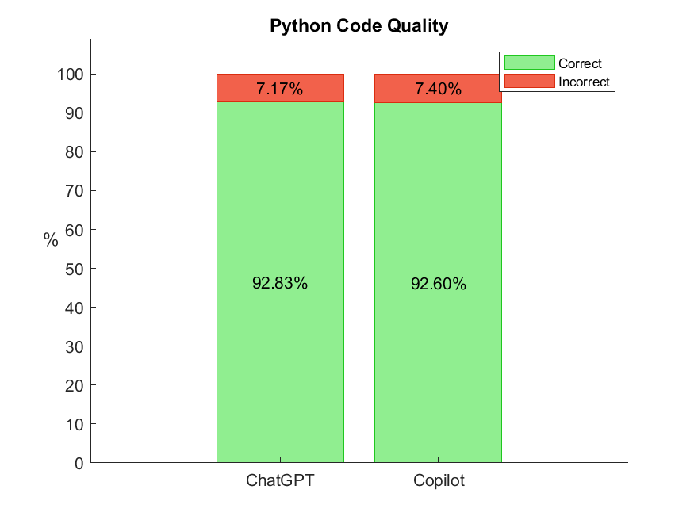  

The experiment showed a code quality of 92.90% with ChatGPT and 92.62% with Copilot.  
Copilot reached 5.43% less than the achieved results in Java, while ChatGPT also achieved 5.1% less.

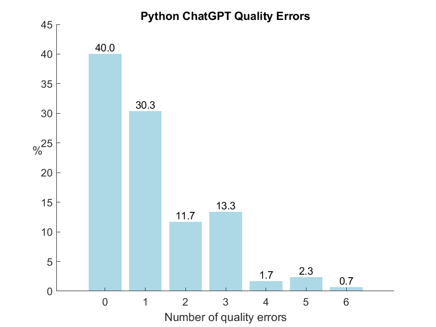   

The amount of zero quality errors with ChatGPT was noticeably lower than the ones achieved for java.  
While ChatGPT achieved 73.7% zero quality errors in Java, it only achieved around 40% in python.

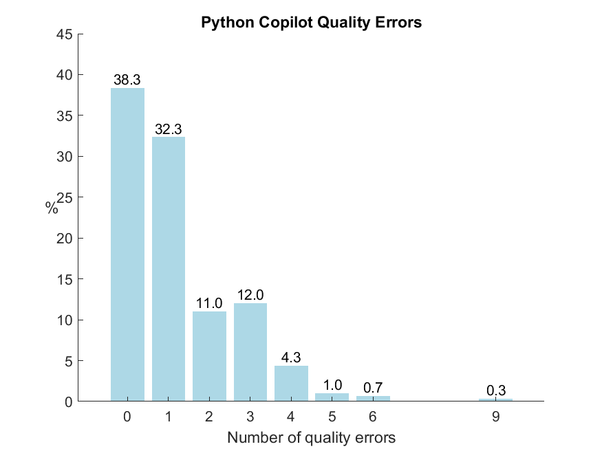  

The amount of zero quality errors with Copilot was also noticeably lower compared to java.  
While Copilot also achieved 69% zero quality errors in Java, it only achieved around 39% in python.  

| |ChatGPT data | Copilot data |
|---------|----------|---------|
|Mean, Mode, Median | https://www.ai-therapy.com/psychology-statistics/results/20231004083626371 | https://www.ai-therapy.com/psychology-statistics/results/20231004084121477 |
|Dispersion | https://www.ai-therapy.com/psychology-statistics/results/20231004083737728 | https://www.ai-therapy.com/psychology-statistics/results/20231004084031936 |
|Normality test | https://www.ai-therapy.com/psychology-statistics/results/20231004083855613 | https://www.ai-therapy.com/psychology-statistics/results/20231004083949044 |

### Hypothesis testing tables
**Hypothesis test - comparing ChatGPT and Copilot:**
Comparing the code quality of ChatGPT with Copilot:
|[Mann-Whitney U-Test](https://www.ai-therapy.com/psychology-statistics/results/20230916110546456) | Code Quality |
|---|---|
|U| 44503.500|
|z-score|-0.246|
|P| 0.806|
|Effect size r| -0.010|  

$\rightarrow$ no statistically significant difference between Copilot and ChatGPT based on a significance level of 0.05 
  
**Hypothesis test - comparing Java and Python:**  
Comparing the code quality of ChatGPT for algorithms written in Java with the results for Python:
|[Mann-Whitney U-Test](https://www.ai-therapy.com/psychology-statistics/results/20230922122916623) | ChatGPT |
|---|---|
|U| 30075.500 |
|z-score| -7.841|
|P| < 0.001|
|Effect size r| -0.320|  

$\rightarrow$ statistically significant difference between Python and Java based on a significance level of 0.01  

Comparing the code quality of Copilot for algorithms written in Java with the results for Python:
|[Mann-Whitney U-Test](https://www.ai-therapy.com/psychology-statistics/results/20230922123234513) | Copilot |
|---|---|
|U| 29820.500 |
|z-score| -7.869 |
|P| < 0.001 |
|Effect size r| -0.321 |  

$\rightarrow$ statistically significant difference between Python and Java based on a significance level of 0.01

### Representation of code quality results in Python
| |  Total number of lines|  Lines without errors| Lines with errors|
|---|---|---|---|
|ChatGPT| 4903 | 4555 | 348|
|Copilot| 4849 | 4491| 358|

### Frequency tables
**ChatGPT:**  
| No. of quality rule violations |0|1|2|3|4|5|6|  
|---|---|---|---|---|---|---|---|
|Frequency| 120 | 91 |35|40 |5 |7|2|  
  
**Copilot:**
| No. of quality rule violations |0|1|2|3|4|5|6|7|8|9|
|---|---|---|---|---|---|---|---|---|---|---|
|Frequency| 115|97 |33 |36 |13|3|2|0|0|1|

### Descriptive statistics of the code quality results in Python

**ChatGPT:**  

|Number of samples |	300 |
|---|---|
|Mean| 1.160 |
|Standard error of the mean| 0.075 | 
|95% confidence interval for the mean| [1.011, 1.309] |
|Median| 1.00|
|Mode| 	0 (Count = 120)|
|Range| 	6 - 0 = 6| 
|Interquartile range (IQR)| 	2.000 - 0.000 = 2.000|
|Sample standard deviation|  	1.312|  
  
**Copilot:**
|Number of samples |	300 |
|---|---|
|Mean| 	1.193 |
|Standard error of the mean| 0.079 |
|95% confidence interval for the mean| [1.038, 1.349] |
|Median| 1.00|
|Mode| 	0 (Count = 116)|
|Range| 	9 - 0 = 9|
|Interquartile range (IQR)| 	1.000 - 0.000 = 1.000|
|Sample standard deviation|  	1.370|

## Conclusion  
- The code quality of both AI models was around 5% lower than the achieved results in Java.
- The code correctness of both AI models was around 10% lower than the achieved results in Java.
- The amount of zero quality errors was noticeably lower than in Java.
- **ChatGPT achieved again better results than Copilot.**
- **The Python experiment showed worse results than the Java experiment.**

___

# IV. Adding 6 more algorithms in Java and Python
$\rightarrow$ the 'old' 6 algorithms were kept and 6 new algorithms were added to the experiment, according to the [TOP 25 algotihms every programmer should know](https://medium.com/techie-delight/top-25-algorithms-every-programmer-should-know-373246b4881b)  
$\rightarrow$ the new algorithms were added to the analysis tests on the code correctness and code quality  
$\rightarrow$ new book examples and tests were added to the project  
$\rightarrow$ new algorithms: *Bellman Ford, Depth First Search, Dijkstra, Egyptian Fractions, Floyd Warshall, Kruskal*

## Code Correctness

### Java
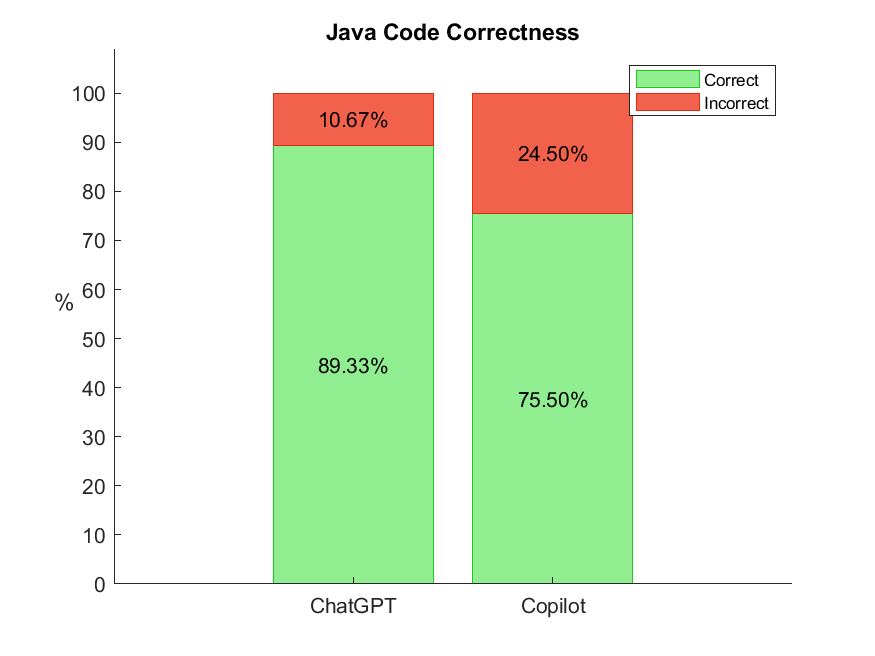  

The code correctness of ChatGPT shown in the figure above, is now 10% lower regarding 12 algorithms (with 89.33%) compared to the experiment before with 6 algorithms.
On the other side, the code correctness of Copilot is 12.83% lower than in the experiment before, with 75.5%.  

| |ChatGPT data | Copilot data |
|---------|----------|---------|
|Mean, Mode, Median | https://www.ai-therapy.com/psychology-statistics/results/20230922144727108 | https://www.ai-therapy.com/psychology-statistics/results/20230922144755056 |
|Dispersion | https://www.ai-therapy.com/psychology-statistics/results/20230922144704553 | https://www.ai-therapy.com/psychology-statistics/results/20230922144813189 |
|Normality test | https://www.ai-therapy.com/psychology-statistics/results/20230922144629088 | https://www.ai-therapy.com/psychology-statistics/results/20230922144850536 |

#### Hypothesis testing data table for the Java code correctness
Testing the code correctness of ChatGPT against Copilot:

|[Mann-Whitney U-Test](https://www.ai-therapy.com/psychology-statistics/results/20231111102137758) | Java Code Correctness|
|---|---|
|U| 155100.000 |
|z-score| - 6.291|
|p | < 0.001 |
|Effect size r|  - 0.182|  

$\rightarrow$ statistically significant difference based on a significance level of 0.01

#### Frequency table for the code correctness results for ChatGPT and Copilot
| Java | Number of generations | Correct generations | Incorrect generations|
|---------|-----------------------|---------------------|----|
|ChatGPT| 600| 536                 |64|
|Copilot| 600| 453                 |147|

### Python
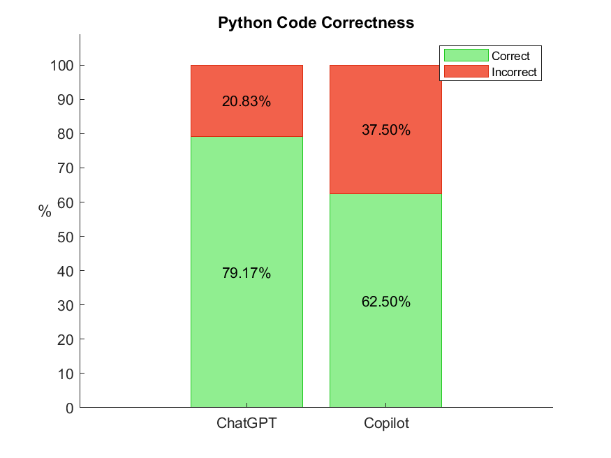   

The code correctness of ChatGPT shown in the figure above, is now 10.14% lower regarding 12 algorithms (with 79.19%) compared to the experiment before with 6 algorithms.
On the other side, the code correctness of Copilot is 13.5% lower than in the experiment before, with 62.5%.  

| |ChatGPT data | Copilot data |
|---------|----------|---------|
|Mean, Mode, Median | https://www.ai-therapy.com/psychology-statistics/results/20230922144434667 | https://www.ai-therapy.com/psychology-statistics/results/20230922144151681 |
|Dispersion | https://www.ai-therapy.com/psychology-statistics/results/20230922144411895 | https://www.ai-therapy.com/psychology-statistics/results/20230922144219794 |
|Normality test | https://www.ai-therapy.com/psychology-statistics/results/20230922144347165 | https://www.ai-therapy.com/psychology-statistics/results/20230922144256711 |

#### Hypothesis testing data table for the code correctness
Testing the code correctness of ChatGPT against Copilot:

|[Mann-Whitney U-Test](https://www.ai-therapy.com/psychology-statistics/results/20231111102320935) | Python Code Correctness|
|---|---|
|U| 150000.000 |
|z-score| - 6.348|
|p |  < 0.001 |
|Effect size r| - 0.183|  

$\rightarrow$ statistically significant difference based on a significance level of 0.01
$\rightarrow$ same result as in the experiment with 6 algorithms

#### Frequency table for the code correctness results for ChatGPT and Copilot
| Python | Number of generations | Correct generations | Incorrect generations|
|---------|-----------------------|---------------------|----|
|ChatGPT| 600| 475                 |125|
|Copilot| 600| 375                 |225|

### Comparing the Code Correctness of Java and Python
As also shown in the experiment before with 6 algorithms, the code correctness of Python is lower than the one of java. It is noticeable, that the differences are about the same as already seen before, with about 10% less for ChatGPT and about 13% less for Copilot.

**Hypothesis test - comparing Java and Python:**  
Comparing the code correctness of ChatGPT for algorithms written in Java with the results for Python:
|[Mann-Whitney U-Test](https://www.ai-therapy.com/psychology-statistics/results/20231111102532634) | ChatGPT |
|---|---|
|U| 161700.000 |
|z-score| -4.832 |
|P|   < 0.001 |
|Effect size r|  -0.139 |  

$\rightarrow$ statistically significant difference for ChatGPT between Python and Java based on a significance level of 0.01   

Comparing the code correctness of Copilot for algorithms written in Java with the results for Python:
|[Mann-Whitney U-Test](https://www.ai-therapy.com/psychology-statistics/results/20230922143540378) | Copilot |
|---|---|
|U| 156600.000 |
|z-score| -4.867 |
|P|  < 0.001 |
|Effect size r|  -0.140 |

$\rightarrow$ statistically significant difference for Copilot between Python and Java based on a significance level of 0.01  
  

It is also noticeable that the code correctness of both programming languages is about 10% lower for ChatGPT and about 13% lower for Copilot considering 12 algorithms instead of 6.

**Hypothesis test - comparing Java 12 with 6 algorithms:**  
Comparing the code correctness of ChatGPT with 12 Java algorithms against the results with 6 Java algorithms:
| [Mann-Whitney U Test](https://www.ai-therapy.com/psychology-statistics/results/20230922143231520) | Java Code Correctness ChatGPT |
| --- | --- |
| U | 81000.000 |
| z-score | -5.422 |
| p-value |  < 0.001 |
| effect size r | -0.181 |  

$\rightarrow$ statistically significant difference based on a significance level of 0.01

Comparing the code correctness of Copilot with 12 Java algorithms against the results with 6 Java algorithms:
| [Mann-Whitney U Test](https://www.ai-therapy.com/psychology-statistics/results/20230922143354733) | Java Code Correctness Copilot |
| --- | --- |
| U | 78450.000 |
| z-score | -4.516 |
| p-value | < 0.001 |
| effect size r | -0.151 |  

$\rightarrow$ statistically significant difference based on a significance level of 0.01

**Hypothesis test - comparing Python 12 with 6 algorithms:**  
Comparing the code correctness of ChatGPT with 12 Python algorithms against the results with 6 Python algorithms:
| [Mann-Whitney U Test](https://www.ai-therapy.com/psychology-statistics/results/20230922142900411) | Python Code Correctness ChatGPT |
| --- | --- |
| U | 80850.000 |
| z-score | -3.787 |
| p-value | < 0.001 |
| effect size r |  -0.126  |  

$\rightarrow$ statistically significant difference based on a significance level of 0.01  

Comparing the code correctness of Copilot with 12 Python algorithms against the results with 6 Python algorithms:

| [Mann-Whitney U Test](https://www.ai-therapy.com/psychology-statistics/results/20230922143048268) | Python Code Correctness Copilot |
| --- | --- |
| U | 77850.000 |
| z-score | -4.058  |
| p-value | < 0.001 |
| effect size r |  -0.135 |  

$\rightarrow$ statistically significant difference based on a significance level of 0.01

## Code Quality

### Java
  

The experiment showed a code quality of 98.09% for generated code with ChatGPT and 98.13% with Copilot. This shows that both ChatGPT and Copilot generate code of very high quality regardless the number of algorithms. There are only small differences compared to the experiment before.
For comparison, the code quality for 6 algorithms reached 98% for ChatGPT and 98.05% for Copilot. 

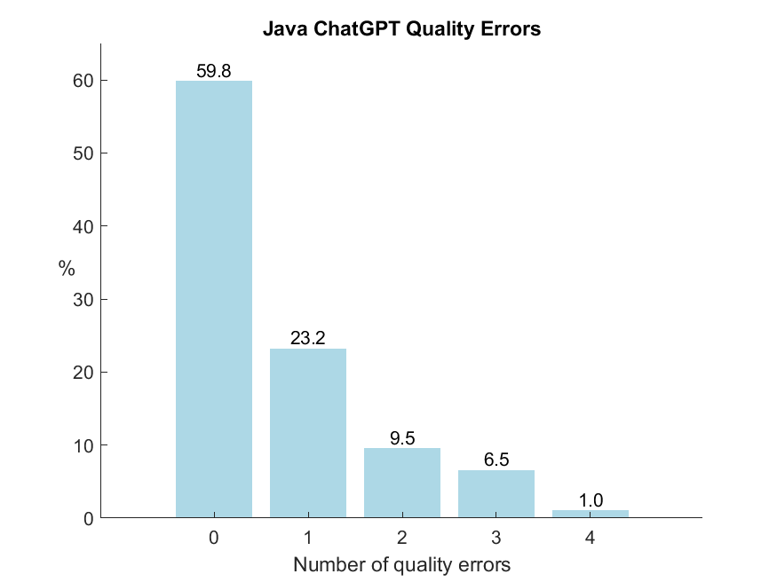   

The percentage of zero quality errors for ChatGPT is 13.9% lower compared to the experiment with 6 algorithms. 
Apart from that, it is noticeable that the percentage of one quality error improved about 10%.

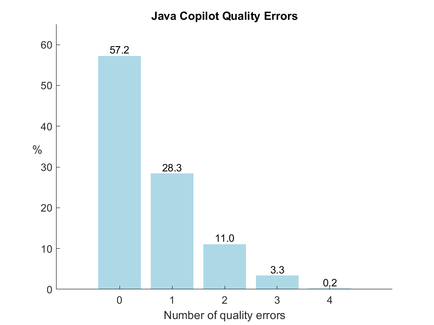  

The percentage of zero quality errors for Copilot is 11.8% lower compared to the experiment with 6 algorithms. 
As already shown with ChatGPT, Copilot also improved the percentage of one quality error about 10% considering the 12 algorithms.

| |ChatGPT data | Copilot data |
|---------|----------|---------|
|Mean, Mode, Median | https://www.ai-therapy.com/psychology-statistics/results/20230922125457835 | https://www.ai-therapy.com/psychology-statistics/results/20230922125911300 |
|Dispersion | https://www.ai-therapy.com/psychology-statistics/results/20230922125614192 | https://www.ai-therapy.com/psychology-statistics/results/20230922125831227 |
|Normality test | https://www.ai-therapy.com/psychology-statistics/results/20230922125721837 | https://www.ai-therapy.com/psychology-statistics/results/20230922125806193 |

#### Hypothesis testing data table for the code quality in Java
Testing the code quality of ChatGPT against Copilot:

|[Mann-Whitney U-Test](https://www.ai-therapy.com/psychology-statistics/results/20230922130117040) | Java Code Quality |
|---|---|
|U| 178750.500 |
|z-score| -0.235 |
|P| 0.814 |
|Effect size r| -0.007 |  

$\rightarrow$ no statistically significant difference between ChatGPT and Copilot based on a significance level of 0.05  
$\rightarrow$ same result as in the experiment with 6 algorithms

#### Representation of code quality results
| Java |  Total number of lines|  Lines without errors| Lines with errors|
|---|---|---|---|
|ChatGPT| 20657| 20263|394|
|Copilot| 19552| 19186|366|

#### Frequency tables
**ChatGPT:**  

| No. of quality rule violations |0|1|2|3|4|
|---|---|---|---|---|---|
|Frequency|359|139|57|39|6|  
  
**Copilot:**
| No. of quality rule violations |0|1|2|3|4|
|---|---|---|---|---|---|
|Frequency|343|170|66|20|1|

#### Descriptive statistics of the code quality results in Java

**ChatGPT:**  

|Number of samples |	600 |
|---|---|
|Mean| 0.657 |
|Standard error of the mean|0.039| 
|95% confidence interval for the mean| [0.579, 0.734] |
|Median| 0.00|
|Mode| 	0 (Count = 359)|
|Range| 	4 - 0 = 4| 
|Interquartile range (IQR)| 	1.000 - 0.000 = 1.000|
|Sample standard deviation|  	0.963|  
  
**Copilot:**
|Number of samples |	600 |
|---|---|
|Mean| 0.610 |
|Standard error of the mean| 0.034 |
|95% confidence interval for the mean| [0.544, 0.676] |
|Median| 0.00|
|Mode| 	0 (Count = 343)|
|Range| 	4 - 0 = 4|
|Interquartile range (IQR)| 	1.000 - 0.000 = 1.000|
|Sample standard deviation|  	0.824|

### Python
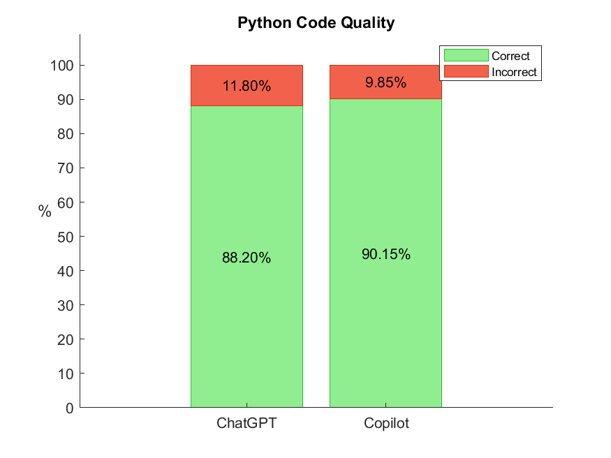  

The experiment showed a code quality of 88.20% for generated code with ChatGPT and 90.15% with Copilot. This shows that both ChatGPT and Copilot generate code of high quality regardless the number of algorithms. There are small differences compared to the experiment before.
For comparison, the code quality for 6 algorithms reached 92.90% for ChatGPT and 92.62% for Copilot. 

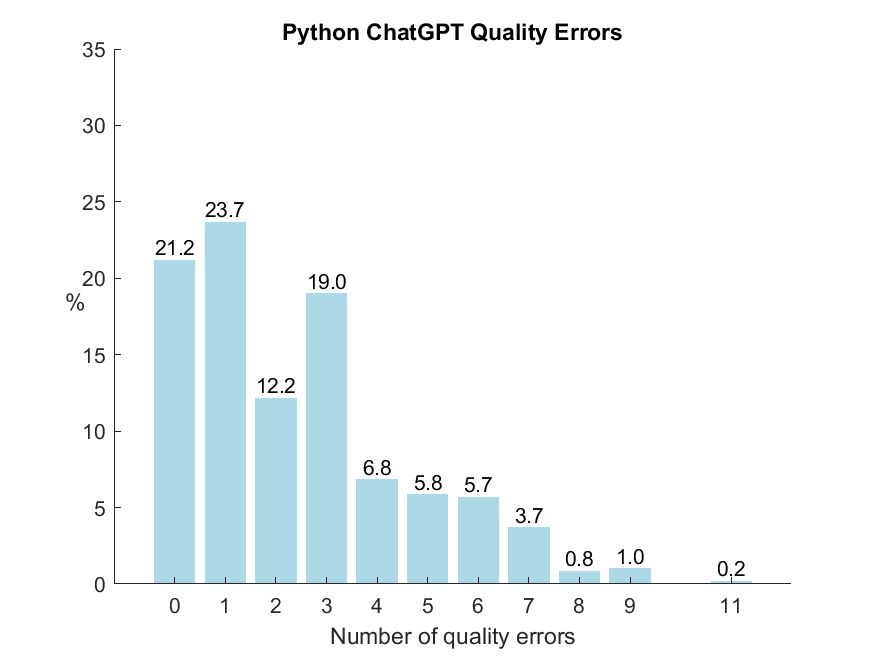   

The percentage of zero quality errors for ChatGPT is only half as high compared to the experiment with 6 algorithms. A maximum of 11 quality errors are achieved while the experiment with 6 algorithms reached a maximum of 6 quality errors.

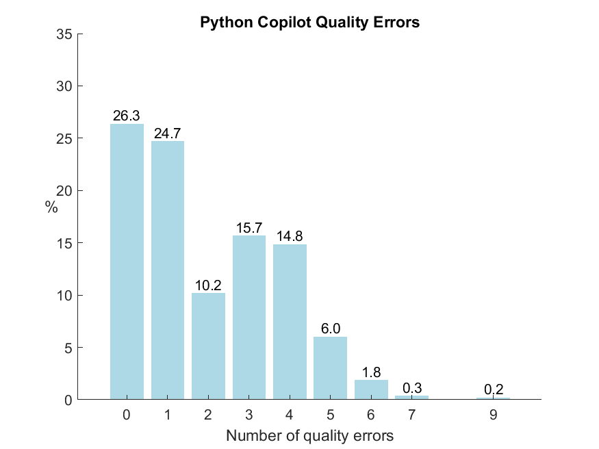    

The percentage of zero quality errors for Copilot is 12.4% lower compared to the experiment with 6 algorithms. 
The maximum number of quality errors is still 9, as also achieved before with 6 algorithms.

| |ChatGPT data | Copilot data |
|---------|----------|---------|
|Mean, Mode, Median | https://www.ai-therapy.com/psychology-statistics/results/20230922135305224 | https://www.ai-therapy.com/psychology-statistics/results/20230922135749242 |
|Dispersion | https://www.ai-therapy.com/psychology-statistics/results/20230922135429913 | https://www.ai-therapy.com/psychology-statistics/results/20230922135657746 |
|Normality test | https://www.ai-therapy.com/psychology-statistics/results/20230922135540031 | https://www.ai-therapy.com/psychology-statistics/results/20230922135629920 |

#### Hypothesis testing data table for the code quality in Python
Testing the code quality of ChatGPT against Copilot:

|[Mann-Whitney U-Test](https://www.ai-therapy.com/psychology-statistics/results/20231111102713209) | Python Code Quality |
|---|---|
|U| 164198.000 |
|z-score| - 2.681 |
|P| 0.007 |
|Effect size r|  - 0.077 |  

$\rightarrow$ statistically significant difference between ChatGPT and Copilot based on a significance level of 0.05  
$\rightarrow$ opposite result as in the experiment with 6 algorithms

#### Representation of code quality results
| Python |  Total number of lines|  Lines without errors| Lines with errors|
|---|---|---|---|
|ChatGPT| 12132| 10700|1432|
|Copilot| 11945| 10768|1177|

#### Frequency tables
**ChatGPT:**  

| No. of quality rule violations |0|1|2|3|4|5|6|7|8|9|10|11|
|---|---|---|---|---|---|--|--|--|--|--|--|--|
|Frequency|127|142|73|114|41|35|34|22|5|6|0|1|  
  
**Copilot:**  

| No. of quality rule violations |0|1|2|3|4|5|6|7|8|9|
|---|---|---|---|---|---|--|--|--|--|--|
|Frequency|158|148|61|94|89|36|11|2|0|1|

#### Descriptive statistics of the code quality results in Python

**ChatGPT:**  

|Number of samples |	600 |
|---|---|
|Mean| 2.387 |
|Standard error of the mean|0.088| 
|95% confidence interval for the mean| [2.213, 2.560] |
|Median| 2.00|
|Mode| 	1 (Count = 142)|
|Range| 	11 - 0 = 11| 
|Interquartile range (IQR)| 	3.000 - 1.000 = 2.000|
|Sample standard deviation|  	2.163|  
  
**Copilot:**
|Number of samples |	600 |
|---|---|
|Mean| 1.962 |
|Standard error of the mean| 0.071 |
|95% confidence interval for the mean| [1.822, 2.102] |
|Median| 1.00|
|Mode| 	0 (Count = 158)|
|Range| 	9 - 0 = 9|
|Interquartile range (IQR)| 	3.000 - 0.000 = 3.000|
|Sample standard deviation|  	1.747|

### Comparing the Code Quality of Java and Python
As also shown in the experiment before with 6 algorithms, the code quality of Python is lower than the one of Java, with about 10% for ChatGPT and about 8% for Copilot.

**Hypothesis test - comparing Java and Python:**  
Comparing the code quality of ChatGPT for algorithms written in Java with the results for Python:  
|[Mann-Whitney U-Test](https://www.ai-therapy.com/psychology-statistics/results/20230922141134585) | ChatGPT |
|---|---|
|U| 86152.000 |
|z-score| -16.325 |
|P|  < 0.001 |
|Effect size r|  -0.471  |  

$\rightarrow$ statistically significant difference for ChatGPT between Python and Java based on a significance level of 0.01  
$\rightarrow$ same result as in the experiment with 6 algorithms
  
Comparing the code quality of Copilot for algorithms written in Java with the results for Python:
|[Mann-Whitney U-Test](https://www.ai-therapy.com/psychology-statistics/results/20230922141326709) | Copilot |
|---|---|
|U| 97531.500 |
|z-score| -14.433 |
|P|< 0.001 |
|Effect size r|  -0.417 |  

$\rightarrow$ statistically significant difference for Copilot between Python and Java based on a significance level of 0.01  
$\rightarrow$ same result as in the experiment with 6 algorithms
  

Compared to the experiment with 6 algorithms, it is noticeable that the quality of generated Java code stayed nearly the same, while the quality of Python code decreased slightly (2% for Copilot and 4% for ChatGPT).

**Hypothesis test - comparing Java 12 with 6 algorithms:**  
Comparing the code quality of ChatGPT with 12 Java algorithms against the results with 6 Java algorithms:

| [Mann-Whitney U Test](https://www.ai-therapy.com/psychology-statistics/results/20230922141939949) | Java Code Quality ChatGPT |
| --- | --- |
| U | 78914.000 |
| z-score | -3.545 |
| p-value |  < 0.001 |
| effect size r |  -0.118 |  

$\rightarrow$ statistically significant difference based on a significance level of 0.01  

Comparing the code quality of Copilot with 12 Java algorithms against the results with 6 Java algorithms:

| [Mann-Whitney U Test](https://www.ai-therapy.com/psychology-statistics/results/20230922142212241) | Java Code Quality Copilot |
| --- | --- |
| U | 79757.000 |
| z-score |  -3.208 |
| p-value | 0.001 |
| effect size r | -0.107 |  

$\rightarrow$ statistically significant difference based on a significance level of 0.01

**Hypothesis test - comparing Python 12 with 6 algorithms:**  
Comparing the code quality of ChatGPT with 12 Python algorithms against the results with 6 Python algorithms:

| [Mann-Whitney U Test](https://www.ai-therapy.com/psychology-statistics/results/20230922142439768) | Python Code Quality ChatGPT |
| --- | --- |
| U | 59372.500 |
| z-score | -8.525 |
| p-value | < 0.001 |
| effect size r | -0.284 |  

$\rightarrow$ statistically significant difference based on a significance level of 0.01  

Comparing the code quality of Copilot with 12 Python algorithms against the results with 6 Python algorithms:

| [Mann-Whitney U Test](https://www.ai-therapy.com/psychology-statistics/results/20230922142625039) | Python Code Quality Copilot |
| --- | --- |
| U | 67502.500 |
| z-score | -6.291 |
| p-value | < 0.001 |
| effect size r |  -0.210 |  

$\rightarrow$ statistically significant difference based on a significance level of 0.01
