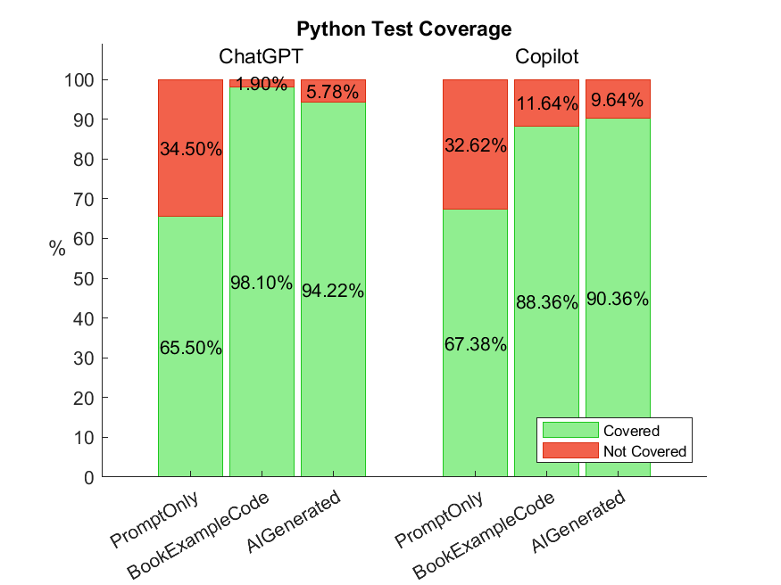

# Generating Tests based on different Approaches
$\rightarrow$ running analysis tests on test correctness, levenshtein distances and code coverage based on generated data for 12 different algorithms in Java and Python considering the 3 approaches *AIGenerated, BookExampleCode, PromptOnly*

## Test Correctness
### Java
 

| Java |ChatGPT data | Copilot data |
|---------|----------|---------|
|Mean, Mode, Median | https://www.ai-therapy.com/psychology-statistics/results/20231014174004808 | https://www.ai-therapy.com/psychology-statistics/results/20231014174340691 |
|Dispersion | https://www.ai-therapy.com/psychology-statistics/results/20231014174043166 | https://www.ai-therapy.com/psychology-statistics/results/20231014174317297 |
|Normality test | https://www.ai-therapy.com/psychology-statistics/results/20231014174211684 | https://www.ai-therapy.com/psychology-statistics/results/20231014174258521 |

#### Hypothesis testing - Test Correctness
$\rightarrow$ testing the three approaches against each other for Copilot and ChatGPT

**Kruskal-Wallis Test:**
- Is there a difference in the rank sums?
- opposite of ANOVA
- no need to have normally distributed data
- non-parametric test
- used for independent samples
- H0: no difference between the 3 approaches
- H1: there is a difference between the 3 approaches, in at least one of them

|[Kruskal-Wallis Test](https://www.ai-therapy.com/psychology-statistics/results/20231111103410983) | Java Test Correctness ChatGPT |
|---|---|
|H(2)| 1.489|
|p | 0.475|  
  
$\rightarrow$ no statistically significant difference between the 3 approaches in ChatGPT based on a significance level of 0.05

|[Kruskal-Wallis Test](https://www.ai-therapy.com/psychology-statistics/results/20230926183159450) | Java Test Correctness Copilot |
|---|---|
|H(2)| 1.751|
|p | 0.417|  
  
$\rightarrow$ no statistically significant difference between the 3 approaches in Copilot based on a significance level of 0.05

#### Hypothesis testing - Test Correctness ChatGPT vs. Copilot
$\rightarrow$ testing the test correctness of ChatGPT against Copilot (all the 3 approaches together)

|[Mann-Whitney U-Test](https://www.ai-therapy.com/psychology-statistics/results/20230926200044073) | Java Test correctness|
|---|---|
|U| 56880.000|
|z-score| -3.304|
|p | < 0.001|
|Effect size r| -0.123|  
  
$\rightarrow$ statistically significant difference between ChatGPT and Copilot based on a significance level of 0.01

### Frequency table for the code correctness results for ChatGPT and Copilot
| Java | Number of generations | Correct generations | Incorrect generations|
|---------|-----------------------|---------------------|----|
|ChatGPT| 360| 179                 |181|
|Copilot| 360| 135                 |225|

### Python
    

| |ChatGPT data | Copilot data |
|---------|----------|---------|
|Mean, Mode, Median | https://www.ai-therapy.com/psychology-statistics/results/20231014174635772 | https://www.ai-therapy.com/psychology-statistics/results/20231014174845382 |
|Dispersion | https://www.ai-therapy.com/psychology-statistics/results/20231014174659244 | https://www.ai-therapy.com/psychology-statistics/results/20231014174823068 |
|Normality test | https://www.ai-therapy.com/psychology-statistics/results/20231014174731212 | https://www.ai-therapy.com/psychology-statistics/results/20231014174800028 |

#### Hypothesis testing - Test Correctness
$\rightarrow$ testing the three approaches against each other for Copilot and ChatGPT

**Kruskal-Wallis Test:**
- H0: no difference between the 3 approaches
- H1: there is a difference between the 3 approaches, in at least one of them

|[Kruskal-Wallis Test](https://www.ai-therapy.com/psychology-statistics/results/20231111103705019) | Python Test Correctness ChatGPT |
|---|---|
|H(2)| 2.143|
|p | 0.343|  
  
$\rightarrow$ no statistically significant difference between the 3 approaches in ChatGPT based on a significance level of 0.05

|[Kruskal-Wallis Test](https://www.ai-therapy.com/psychology-statistics/results/20230926203125779) | Python Test Correctness Copilot |
|---|---|
|H(2)| 3.976|
|p | 0.137|  
  
$\rightarrow$ no statistically significant difference between the 3 approaches in Copilot based on a significance level of 0.05

#### Hypothesis testing - Test Correctness ChatGPT vs. Copilot
$\rightarrow$ testing the test correctness of ChatGPT against Copilot (all the 3 approaches together)

|[Mann-Whitney U-Test](https://www.ai-therapy.com/psychology-statistics/results/20230926204556824) | Python Test correctness|
|---|---|
|U| 57960.000|
|z-score| -2.990|
|p | 0.003|
|Effect size r| -0.111|  
  
$\rightarrow$ statistically significant difference between ChatGPT and Copilot based on a significance level of 0.01

#### Frequency table for the code correctness results for ChatGPT and Copilot
| Python | Number of generations | Correct generations | Incorrect generations|
|---------|-----------------------|---------------------|----|
|ChatGPT| 360| 257                 |103|
|Copilot| 360| 219                 |141|

### Comparing Python and Java
$\rightarrow$ testing the test correctness of Python against Java (ChatGPT and Copilot together)

|[Mann-Whitney U-Test](https://www.ai-therapy.com/psychology-statistics/results/20230926210215349) | Test correctness|
|---|---|
|U|  234000.000|
|z-score| -3.785|
|p | < 0.001|
|Effect size r|  -0.100|  
  
$\rightarrow$ statistically significant difference between Java and Python based on a significance level of 0.01

## Modification Rate
- calculated by dividing the number of modifications (levenshtein distance) by the number of generated characters
### Java
    

| Java |ChatGPT data | Copilot data |
|---------|----------|---------|
|Mean, Mode, Median | https://www.ai-therapy.com/psychology-statistics/results/20231014175738530 | https://www.ai-therapy.com/psychology-statistics/results/20231014180037960 |
|Dispersion | https://www.ai-therapy.com/psychology-statistics/results/20231014175816836 | https://www.ai-therapy.com/psychology-statistics/results/20231014180008955 |
|Normality test | https://www.ai-therapy.com/psychology-statistics/results/20231014175906696 | https://www.ai-therapy.com/psychology-statistics/results/20231014175942039 |

#### Hypothesis testing - Levenshtein Distance
$\rightarrow$ testing the three approaches against each other for Copilot and ChatGPT

**Kruskal-Wallis Test:**
- H0: no difference between the 3 approaches
- H1: there is a difference between the 3 approaches, in at least one of them

|[Kruskal-Wallis Test](https://www.ai-therapy.com/psychology-statistics/results/20230926211123618) | Java Levenshtein Distance ChatGPT |
|---|---|
|H(2)| 22.469|
|p | < 0.001|  
  
$\rightarrow$ statistically significant difference between the 3 approaches in ChatGPT based on a significance level of 0.01

|[Kruskal-Wallis Test](https://www.ai-therapy.com/psychology-statistics/results/20230926211437292) | Java Levenshtein Distance Copilot |
|---|---|
|H(2)| 19.977|
|p |< 0.001|  
  
$\rightarrow$ statistically significant difference between the 3 approaches in Copilot based on a significance level of 0.01

#### Hypothesis testing - Levenshtein Distance ChatGPT vs. Copilot
$\rightarrow$ testing the Levenshtein Distances of ChatGPT against Copilot (all the 3 approaches together)

|[Mann-Whitney U-Test](https://www.ai-therapy.com/psychology-statistics/results/20230926211700625) | Java Levenshtein Distance|
|---|---|
|U| 40589.500|
|z-score| -11.212|
|p | < 0.001|
|Effect size r| -0.418|  
  
$\rightarrow$ statistically significant difference between ChatGPT and Copilot based on a significance level of 0.01

### Python
    

| |ChatGPT data | Copilot data |
|---------|----------|---------|
|Mean, Mode, Median | https://www.ai-therapy.com/psychology-statistics/results/20231014175114881 | https://www.ai-therapy.com/psychology-statistics/results/20231014175536934 |
|Dispersion | https://www.ai-therapy.com/psychology-statistics/results/20231014175144498 | https://www.ai-therapy.com/psychology-statistics/results/20231014175513214 |
|Normality test | https://www.ai-therapy.com/psychology-statistics/results/20231014175422664 | https://www.ai-therapy.com/psychology-statistics/results/20231014175454264 |

#### Hypothesis testing - Levenshtein Distance
$\rightarrow$ testing the three approaches against each other for Copilot and ChatGPT

**Kruskal-Wallis Test:**
- H0: no difference between the 3 approaches
- H1: there is a difference between the 3 approaches, in at least one of them

|[Kruskal-Wallis Test](https://www.ai-therapy.com/psychology-statistics/results/20231111105428231) | Python Levenshtein Distance ChatGPT |
|---|---|
|H(2)|  71.493|
|p | < 0.001|  
  
$\rightarrow$ statistically significant difference between the 3 approaches in ChatGPT based on a significance level of 0.01

|[Kruskal-Wallis Test](https://www.ai-therapy.com/psychology-statistics/results/20231111105541722) | Python Levenshtein Distance Copilot |
|---|---|
|H(2)| 19.502|
|p | < 0.001|  
  
$\rightarrow$ statistically significant difference between the 3 approaches in Copilot based on a significance level of 0.01

#### Hypothesis testing - Levenshtein Distance ChatGPT vs. Copilot
$\rightarrow$ testing the Levenshtein Distances of ChatGPT against Copilot (all the 3 approaches together)

|[Mann-Whitney U-Test](https://www.ai-therapy.com/psychology-statistics/results/20230926212806271) | Python Levenshtein Distance|
|---|---|
|U| 45498.500|
|z-score| -8.974|
|p | < 0.001|
|Effect size r| -0.334|  
  
$\rightarrow$ statistically significant difference between ChatGPT and Copilot based on a significance level of 0.01

### Comparing Python and Java
$\rightarrow$ testing the levenshtein distance of Python against Java (ChatGPT and Copilot together)

|[Mann-Whitney U-Test](https://www.ai-therapy.com/psychology-statistics/results/20231111105046468) | Levenshtein Distance|
|---|---|
|U|  259117.500|
|z-score| -0.014|
|p |  0.989|
|Effect size r|  -0.000|  
  
$\rightarrow$ no statistically significant difference between Java and Python based on a significance level of 0.05

## Test Coverage
### Java
  

  
 

  

| |ChatGPT data | Copilot data |
|---------|----------|---------|
|Mean, Mode, Median | https://www.ai-therapy.com/psychology-statistics/results/20231014180218501 | https://www.ai-therapy.com/psychology-statistics/results/20231014180338252 |
|Dispersion | https://www.ai-therapy.com/psychology-statistics/results/20231014180239265 | https://www.ai-therapy.com/psychology-statistics/results/20231014180356509 |
|Normality test | https://www.ai-therapy.com/psychology-statistics/results/20231014180306590 | https://www.ai-therapy.com/psychology-statistics/results/20231014180423421 |

#### Hypothesis testing - Test Coverage
$\rightarrow$ testing the three approaches against each other for Copilot and ChatGPT

**Kruskal-Wallis Test:**
- H0: no difference between the 3 approaches
- H1: there is a difference between the 3 approaches, in at least one of them

|[Kruskal-Wallis Test](https://www.ai-therapy.com/psychology-statistics/results/20231111104059593) | Java Test Coverage ChatGPT |
|---|---|
|H(2)|  1.799|
|p | 0.407|  
  
$\rightarrow$ no statistically significant difference between the 3 approaches in ChatGPT based on a significance level of 0.05

|[Kruskal-Wallis Test](https://www.ai-therapy.com/psychology-statistics/results/20231111104309487) | Java Test Coverage Copilot |
|---|---|
|H(2)| 6.769|
|p |  0.034|  
  
$\rightarrow$ statistically significant difference between the 3 approaches in Copilot based on a significance level of 0.05

#### Hypothesis testing - Test Coverage ChatGPT vs. Copilot
$\rightarrow$ testing the Test Coverage of ChatGPT against Copilot (all the 3 approaches together)

|[Mann-Whitney U-Test](https://www.ai-therapy.com/psychology-statistics/results/20230926214810412) | Java Test Coverage|
|---|---|
|U| 57456.000|
|z-score| -2.635|
|p | 0.008|
|Effect size r| -0.098|  
  
$\rightarrow$ statistically significant difference between ChatGPT and Copilot based on a significance level of 0.01

#### Descriptive statistics of the Test Coverage results

**ChatGPT:**  

|Number of samples |	360 |
|---|---|
|Mean| 58.791 |
|Standard error of the mean|0.666| 
|95% confidence interval for the mean| [57.482, 60.100] |
|Median| 	64.29|
|Mode| 	66.67 (Count = 43)|
|Range| 		75.000 - 31.580 = 43.420| 
|Interquartile range (IQR)| 	66.950 - 46.670 = 20.280|
|Sample standard deviation|  		12.628|  
  
**Copilot:**
|Number of samples |	360 |
|---|---|
|Mean| 57.180 |
|Standard error of the mean| 0.668 |
|95% confidence interval for the mean| [55.867, 58.493] |
|Median| 61.54|
|Mode| 	66.67 (Count = 37)|
|Range| 	75.000 - 23.940 = 51.060|
|Interquartile range (IQR)| 	66.670 - 50.000 = 16.670|
|Sample standard deviation|  	12.672|

### Python
  

   

   

| |ChatGPT data | Copilot data |
|---------|----------|---------|
|Mean, Mode, Median |  https://www.ai-therapy.com/psychology-statistics/results/20231014180928851 | https://www.ai-therapy.com/psychology-statistics/results/20231014181408346 |
|Dispersion | https://www.ai-therapy.com/psychology-statistics/results/20231014180952019 | https://www.ai-therapy.com/psychology-statistics/results/20231014181309179 |
|Normality test | https://www.ai-therapy.com/psychology-statistics/results/20231014181211619 |  https://www.ai-therapy.com/psychology-statistics/results/20231014181245043|

#### Hypothesis testing - Test Coverage
$\rightarrow$ testing the three approaches against each other for Copilot and ChatGPT

**Kruskal-Wallis Test:**
- H0: no difference between the 3 approaches
- H1: there is a difference between the 3 approaches, in at least one of them

|[Kruskal-Wallis Test](https://www.ai-therapy.com/psychology-statistics/results/20231111104546431) | Python Test Coverage ChatGPT |
|---|---|
|H(2)|  39.905|
|p |  < 0.001|  
  
$\rightarrow$ statistically significant difference between the 3 approaches in ChatGPT based on a significance level of 0.01

|[Kruskal-Wallis Test](https://www.ai-therapy.com/psychology-statistics/results/20230926215447516) | Python Test Coverage Copilot |
|---|---|
|H(2)| 23.861|
|p |  < 0.001|  
  
$\rightarrow$ statistically significant difference between the 3 approaches in Copilot based on a significance level of 0.01

#### Hypothesis testing - Test Coverage ChatGPT vs. Copilot
$\rightarrow$ testing the Test Coverage of ChatGPT against Copilot (all the 3 approaches together)
|[Mann-Whitney U-Test](https://www.ai-therapy.com/psychology-statistics/results/20231111104802326) | Python Test Coverage|
|---|---|
|U| 62699.000|
|z-score| -0.857|
|p | 0.391|
|Effect size r| -0.032|  
  
$\rightarrow$ no statistically significant difference between ChatGPT and Copilot based on a significance level of 0.05

#### Descriptive statistics of the Test Coverage results

**ChatGPT:**  

|Number of samples |	360 |
|---|---|
|Mean| 85.939 |
|Standard error of the mean|1.546| 
|95% confidence interval for the mean| 	[82.899, 88.979] |
|Median| 100.00|
|Mode| 		100.00 (Count = 225)|
|Range| 	100.000 - 0.000 = 100.000| 
|Interquartile range (IQR)| 		100.000 - 88.890 = 11.110|
|Sample standard deviation|  		29.329|  
  
**Copilot:**
|Number of samples |	360 |
|---|---|
|Mean| 82.032 |
|Standard error of the mean| 1.697 |
|95% confidence interval for the mean| [78.695, 85.369] |
|Median| 100.00|
|Mode| 		100.00 (Count = 215)|
|Range| 	100.000 - 0.000 = 100.000|
|Interquartile range (IQR)| 	100.000 - 87.500 = 12.500|
|Sample standard deviation|  	32.198|

### Comparing Python and Java
$\rightarrow$ testing the test coverage of Python against Java (ChatGPT and Copilot together)

|[Mann-Whitney U-Test](https://www.ai-therapy.com/psychology-statistics/results/20230926215858966) | Test Coverage|
|---|---|
|U|  85834.500|
|z-score| -22.297|
|p |  < 0.001|
|Effect size r|  -0.588|  
  
$\rightarrow$ statistically significant difference between Java and Python based on a significance level of 0.01
